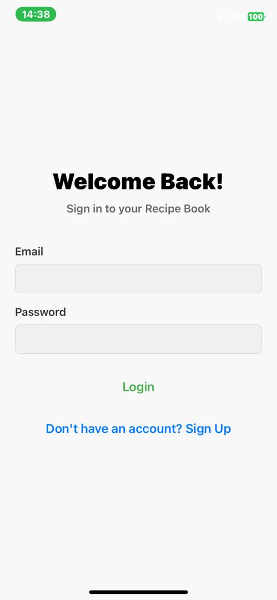
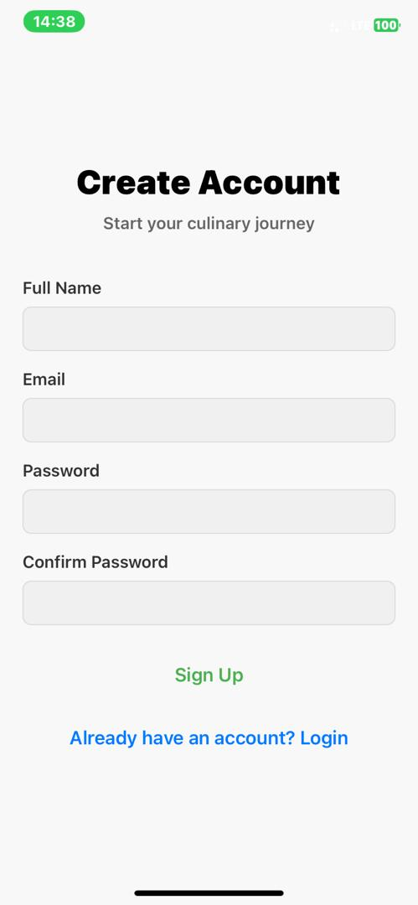
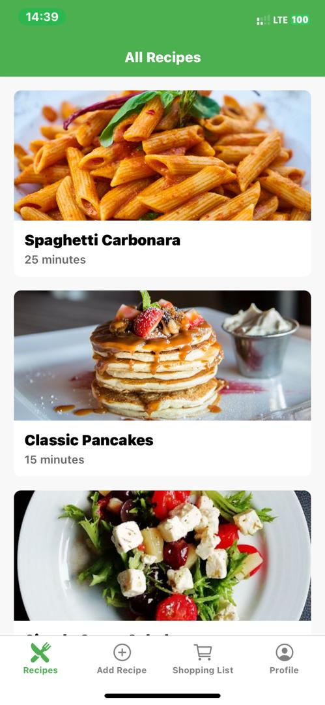
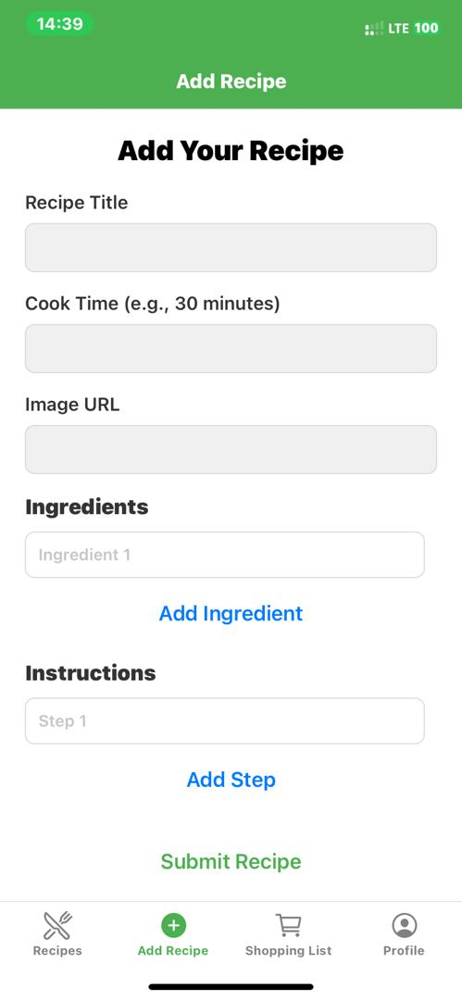
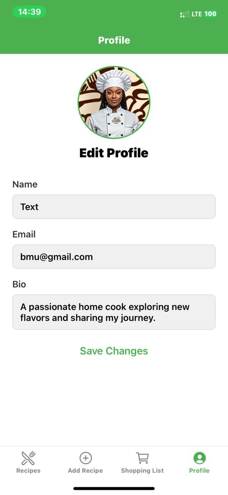

# 📖 Recipe Book App

A mobile application for recipe lovers, designed for iOS and Android. This app allows users to discover, save, and add their own recipes, manage a shopping list, and interact with a community. Built as a beginner-friendly project, it focuses entirely on the front-end, using static data and React Context to simulate a full-stack experience.

## ✨ Features

-   **User Authentication & Management**
    -   ✅ User Login with form validation (email, password).
    -   ✅ User Signup with form validation (name, email, password matching).
    -   ✅ Persistent login state across the app using React Context.
    -   ✅ Editable user profiles with validation.

-   **Recipe Management**
    -   ✅ View a list of all available recipes.
    -   ✅ View detailed information for a single recipe, including ingredients and instructions.
    -   ✅ **Add a new recipe** via a dedicated tab and form.
    -   ✅ Dynamically add/remove ingredient and instruction fields in the "Add Recipe" form.

-   **Interactive Features**
    -   ✅ **Like/Unlike** recipes, with the like count updating in real-time.
    -   ✅ **Post comments** on any recipe.
    -   ✅ Add all ingredients from a recipe directly to the Shopping List with one tap.

-   **Shopping List**
    -   ✅ View a centralized shopping list.
    -   ✅ Mark items as "checked" or "unchecked" with a tap.
    -   ✅ The list dynamically updates when new items are added from recipe pages.

-   **UI & UX**
    -   ✅ Clean, tab-based navigation for main features.
    -   ✅ Stack navigation for drilling down into details (e.g., Recipe List -> Recipe Detail).
    -   ✅ Robust **keyboard handling** (`KeyboardAvoidingView`) ensures that form inputs are never hidden by the on-screen keyboard.
    -   ✅ Reusable components for UI consistency (`RecipeCard`, `CustomInput`).

## 🛠️ Technologies Used

-   **Framework:** React Native with Expo
-   **Navigation:** React Navigation (Stack & Bottom Tabs)
-   **Form Management:** Formik
-   **Validation:** Yup
-   **State Management:** React Context API
-   **Icons:** `@expo/vector-icons`

## 📲 Testing with Expo Go

Once the development server is running, a QR code will be displayed in your terminal and in the browser tab that opens.

1.  Open the **Expo Go** app on your mobile device.
2.  Scan the QR code to open the app. The project will bundle and load on your phone.

> 

## 📸 Screenshots

| Login Screen | Signup Screen |
| :---: |:---:|
|  |  |

| Recipe List | Recipe Detail |
| :---: |:---:|
|   |

| Add Recipe Form | Shopping List |
| :---: |:---:|
|  |  |

| Profile Screen |
| :---: |
|  |

## 🤔 Challenges & Learnings

Building this application provided several valuable learning opportunities.

1.  **Challenge: Dependency Conflicts**
    -   **Problem:** When initially installing React Navigation, `npm` threw an `ERESOLVE` error due to mismatched peer dependencies from a previous version.
    -   **Solution:** The most reliable solution was to perform a clean installation. This involved deleting the `node_modules` folder and the `package-lock.json` file, running `npm install` to get a fresh start, and then using `npx expo install` to add the new packages. This ensures that Expo manages the versions for perfect compatibility.

2.  **Challenge: Managing State Across Disconnected Screens**
    -   **Problem:** The "Add to Shopping List" button on the `RecipeDetailScreen` needed to update the list displayed on the `ShoppingListScreen`. Passing props was not feasible as they are in different tabs.
    -   **Solution:** This was a perfect use case for **React's Context API**. An `AppContext` was created to act as a centralized, front-end "store." All state (user, recipes, shopping list) and the functions to modify it were placed in the context provider. This allowed any component in the tree to access and update the shared state, making the app feel dynamic and interconnected.

3.  **Challenge: Keyboard Hiding Form Inputs**
    -   **Problem:** On smaller screens, when the keyboard appeared to fill out the `Profile` or `Add Recipe` forms, it would cover the input field being typed in.
    -   **Solution:** This was solved by wrapping the form screens in React Native's `<KeyboardAvoidingView>` component. By setting its `behavior` prop to `"padding"` on iOS and `"height"` on Android, the view automatically adjusts its layout to ensure the active input remains visible above the keyboard.

    ## QR Code for testing
this is the QR code generated from expo for testing the app

| QR Code |
| :---: |:---:|
|  | 